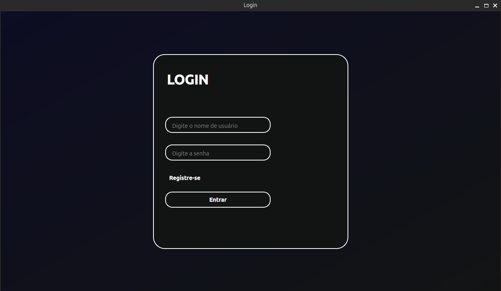
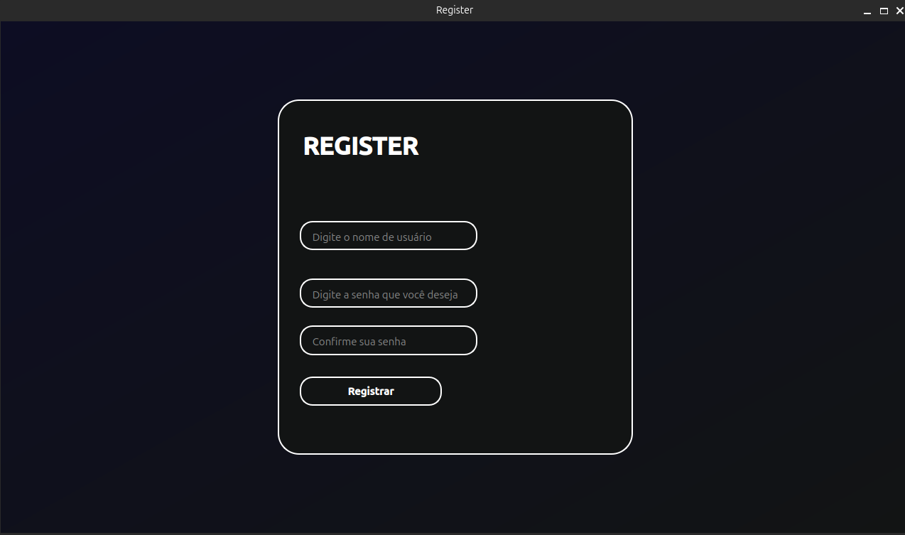

# Login and Registration Interface with PySide6 and MySQL

#Interface de login e registro

Interface de login e registro desktop

## Tecnologias

Esse projeto foi desenvolvido com as seguintes tecnologias:

- [Python](https://python.org/)
- [PySide6](https://www.qt.io/qt-for-python)
- [MySQL](https://www.mysql.com/)

## Screenshots

Login
<h1 align="center">
    
</h1>

Register
<h1 align="center">
    
</h1>

## Passo a passo para rodar o código:

1. Baixe o Python3 e instale a biblioteca do Pyside6 no seu ambiente de desenvolvimento.

2. Baixe o MySQL Workbench.

3. Inicie o servidor do MySQL e modifique o código antes de rodá-lo.

Feito por [Enderson]().
